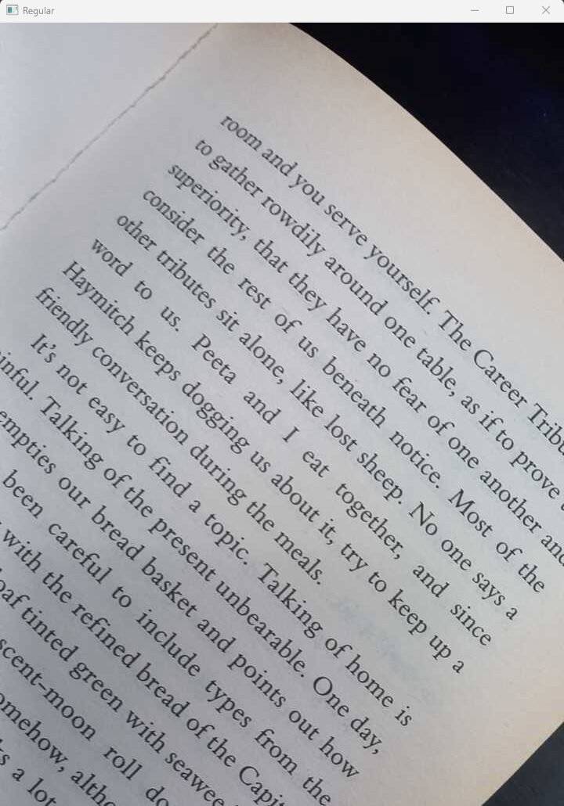

## Realtime OCR with Text-to-Speech
A Python program that captures video from a camera, and performs realtime text-to-speech on any text found in the video. Works on Windows, Linux, and macOS.

## Features
### Multiprocessing
This program uses multiprocessing to improve performance by allocating a separate process for each major task:
  * Capture video from the camera.
  * Preprocess the latest frame from the camera.
  * Perform OCR (Optical Character Regonition) every N seconds on the latest preprocessed frame.
  * Perform text-to-speech if any text is found from the OCR process.
  
### Preprocessing
The preprocessing steps include:
  * Background color correction.
  * Binarizing the image using Otsu thresholding.
  * Deskewing the image to correct its orientation.

<div align="middle">


</div>
  
## Video Source
The program supports two sources for the video:
  * Streaming the video through a mobile phone's camera using the [IP Webcam](https://play.google.com/store/apps/details?id=com.pas.webcam&hl=en&gl=US) app.
  * Using a laptop's webcam or any physically attached webcam.
  
## Requirements
This program was tested on Python 3.9. All external packages used in this program are listed in the [requirements.txt](requirements.txt) file.

You also need to install [Google Tesseract OCR](https://github.com/tesseract-ocr/tesseract) to use the pytesseract package.

### Additional Requirements for Linux
If you are on a linux system and if the voice output is not working, then install espeak, ffmpeg and libespeak1 as shown below:
```
sudo apt update && sudo apt install espeak ffmpeg libespeak1
```

## Usage
### Congifuration File
The server URL for the IP Webcam server, and the webcam id must be specified in the [config.ini](config.ini) file before running the program. If you do not intend to use IP Webcam, then you can ignore the `ip_port` field. Do not remove the field though. The program will automatically try to use the webcam if it notices that the server URL is incorrect, missing, or if the URL is not reachable.

### Closing the Display Windows
Pressing the `q` key when any of the display windows are in focus will close all display windows, and also exit the program.
